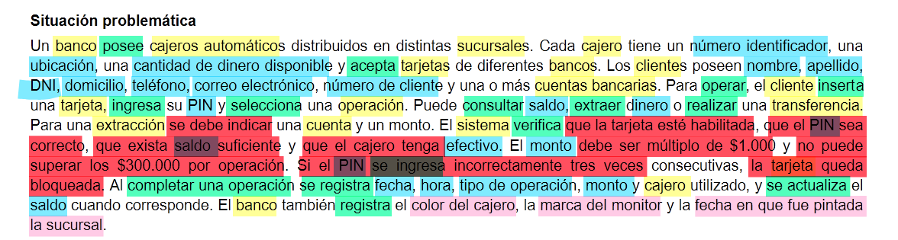

# Identificación de elementos del sistema

Para eso, lo primero que hago es marcar el texto con colores:

Actores o entidades  
personas o cosas que parecen tener algún papel central en el sistema. Son los que hacen las acciones.

Datos o atributos  
información que describe las características de cada una de las cosas marcadas antes.

Acciones  
cosas que alguien o algo hace (verbos).

Reglas  
condiciones que determinan cuándo algo puede o no ocurrir.

Información dudosa  
datos que aparecen en el texto pero que a primera vista no me parecen muy relevantes para el análisis.

La tabla la remarqué en un editor de PDF, pero también se puede imprimir y marcar con resaltador. Aviso que esto NO ESTÁ CHEQUEADO, así que no lo tome nadie como referencia porque no está corregido por nadie y por ende puede estar mal.

---

[← Entrada anterior](entrada-01.md) | [Entrada siguiente →](entrada-03.md)
